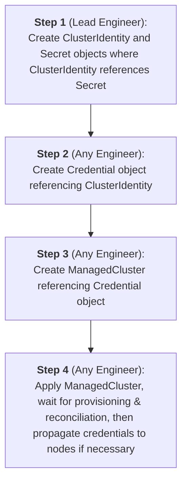

# Credential System

In order for infrastructure provider to work properly a correct credentials
should be passed to it. The following describes how it is implemented in Project 2A.

## The process

The following is the process of passing credentials to the system:

1. Provider specific `ClusterIdentity` and `Secret` are created
2. `Credential` object is created referencing `ClusterIdentity` from step **1**.
3. The `Credential` object is then referenced in the `ManagedCluster`.
4. Optionally, certain credentials MAY be propagated to the `ManagedCluster` after it is created.

The following diagram illustrates the process:



By design steps 1 and 2 should be executed by the lead engineer who has
access to the credentials. Thus credentials could be used by engineers
without a need to have access to actual credentials or underlying resources,
like `ClusterIdentity`.

## Credential object

The `Credential` object acts like a reference to the underlying credentials. It
is namespace-scoped, which means that it must be in the same `Namespace` with
the `ManagedCluster` it is referenced in. Actual credentials can be located in
any namespace.

### Example

```yaml
---
apiVersion: hmc.mirantis.com/v1alpha1
kind: Credential
metadata:
  name: azure-credential
  namespace: dev
spec:
  description: "Main Azure credentials"
  identityRef:
    apiVersion: infrastructure.cluster.x-k8s.io/v1beta1
    kind: AzureClusterIdentity
    name: azure-cluster-identity
    namespace: hmc-system
```

In the example above `Credential` object is referencing `AzureClusterIdentity`
which was created in the `hmc-system` namespace.

The `.spec.description` field can be used to provide arbitrary description of the
object, so user could make a decision which credentials to use if several are
present.

## Cloud provider credentials propagation

Some components in the managed cluster require cloud provider credentials to be
passed for proper functioning. As an example Cloud Controller Manager (CCM)
requires provider credentials to create load balancers and provide other
functionality.

This poses a challenge of credentials delivery. Currently `cloud-init` is used
to pass all necessary credentials. This approach has several problems:

- Credentials stored unencrypted in the instance metadata.
- Rotation of the credentials is impossible without complete instance
  redeployment.
- Possible leaks, since credentials are copied to several `Secret` objects
  related to bootstrap data.

To solve these problems in Project 2A we're using special controller which
aggregates all necessary data from CAPI provider resources (like
`ClusterIdentity`) and creates secrets directly on the managed cluster.

This eliminates the need to pass anything credentials-related to `cloud-init`
and makes it possible to rotate credentials automatically without the need for
instance redeployment.

Also this automation makes it possible to separate roles and responsibilities
where only the lead engineer has access to credentials and other engineers can
use them without seeing values and even any access to underlying
infrastructure platform.

The process is fully automated and credentials will be propagated automatically
within the `ManagedCluster` reconciliation process, user only needs to provide
the correct [Credential object](#credential-object).

### Provider specific notes

Since this feature depends on the provider some notes and clarifications
are needed for each provider.

> NOTE: 
> More detailed research notes can be found [here](https://github.com/Mirantis/hmc/issues/293).

#### AWS

Since AWS uses roles, which are assigned to instances, no additional credentials
will be created.

AWS provider supports 3 types of `ClusterIdentity`, which one to use depends on
your specific use case. More information regarding CAPA `ClusterIdentity`
resources could be found in [CRD Reference](https://cluster-api-aws.sigs.k8s.io/crd/).

#### Azure

Currently Cluster API provider Azure (CAPZ) creates `azure.json` Secrets in the
same namespace with `Cluster` object. By design they should be referenced in the
`cloud-init` YAML later during bootstrap process.

In Project 2A these Secrets aren't used and will not be added to the
`cloud-init`, but engineers can access them unrestricted.
